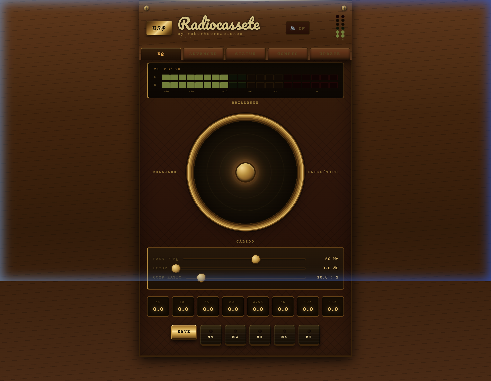
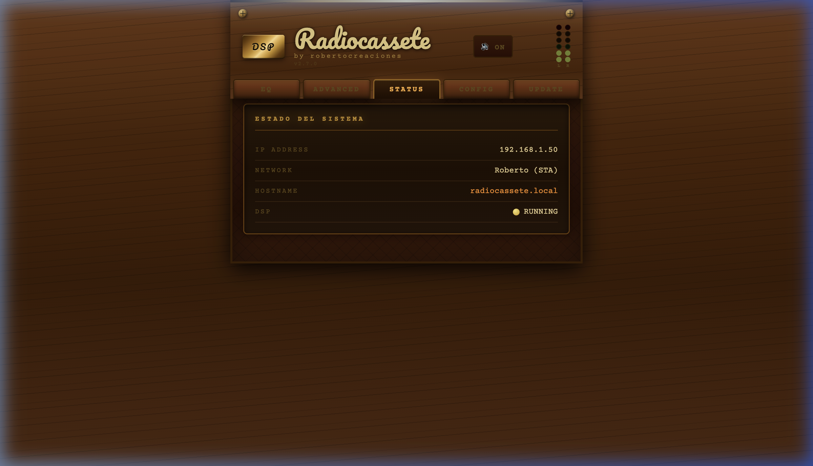

# Radiocassete 8 Bandas - Firmware ESP32



Firmware para controlador de audio basado en **ESP32** y **ADAU1701** DSP. Diseñado para proyectos *restomod* de equipos de audio vintage, permite controlar un procesador de señal digital a través de una interfaz web completa accesible desde cualquier navegador.



## Instalación desde el navegador

Puedes flashear el firmware directamente desde **Google Chrome** o **Microsoft Edge** sin necesidad de instalar ningún software:

**[Instalar Firmware](https://rarranzb.github.io/Radiocassete/)**

Solo necesitas conectar el ESP32 por USB y pulsar el botón de instalación.

## Características principales

### Ecualizador paramétrico de 8 bandas
- **8 filtros biquad** calculados en tiempo real: Low Shelf (40 Hz), 6 bandas Bell (100 Hz – 10 kHz) y High Shelf (16 kHz)
- Cada banda es ajustable en **frecuencia**, **ganancia** (±12 dB) y **factor Q**
- Los coeficientes se escriben al DSP mediante **safeload** para cambios sin glitches
- Frecuencia de muestreo: 48 kHz

### Pad XY (control intuitivo)
- Control bidimensional que moldea el sonido con un solo gesto
- Eje Y: Calidez (graves) ↔ Brillo (agudos)
- Eje X: Energía media
- Traduce la posición del pad en ganancias para las 8 bandas simultáneamente

### Dynamic Bass Boost
- Refuerzo de graves con tres parámetros: **frecuencia de corte**, **ganancia** (dB) y **ratio de compresión** (1:1 – 20:1)
- Escribe directamente a los registros del DSP (shelving + compresor dinámico)

### 5 presets de memoria (M1–M5)
- Guarda y recupera configuraciones completas del EQ: bandas, pad XY, bass boost y compresión
- Almacenados como archivos JSON en SPIFFS, persisten tras reinicio

### Control de volumen por entrada
- Ajuste independiente para **Bluetooth**, **Line In** y **Sine Tone**
- Rango: -30 dB a +6 dB por canal
- Escritura en tiempo real al DSP via safeload

### Mute DAC y Line In
- **Mute DAC**: silencia la salida de audio escribiendo directamente al core register 0x081C del ADAU1701 (bit 3)
- **Mute Line In (ADC)**: silencia la entrada de línea (bit 4 del core register)
- Estado sincronizado en tiempo real vía SSE

### VU Meter en tiempo real
- Lectura del nivel de audio L/R desde los registros **ReadBack** del DSP
- Máquina de estados no bloqueante: una transacción I2C por ciclo cada 15 ms
- Decaimiento de envolvente para visualización suave
- Mini VU vertical con LEDs redondos siempre visible en la cabecera de la web

### Generador de tonos (Sine Tone)
- Generador de onda senoidal estéreo integrado en el DSP
- Control de frecuencia (1 Hz – 23 kHz) y on/off desde la web
- Compatible con el módulo **Tone (Lookup)** de SigmaStudio
- Útil para pruebas de audio y barridos de frecuencia

## Conectividad y red

### WiFi dual (STA + AP)
- **Modo Estación (STA)**: se conecta a tu red WiFi doméstica. Acceso web por `http://radiocassete.local` (mDNS)
- **Modo Punto de Acceso (AP)**: si no encuentra la red configurada, crea automáticamente una red WiFi propia (`Radiocassete` / `adau1701`) con IP `192.168.4.1`
- Reconexión automática si se pierde la conexión WiFi

### Puente TCP ↔ SigmaStudio
- Servidor TCP en el puerto **8086** que implementa el protocolo **TCPi** de Analog Devices
- Permite programar, ajustar y depurar el ADAU1701 **de forma inalámbrica** desde SigmaStudio, como si estuviera conectado por USBi
- Captura automática del programa DSP enviado por SigmaStudio para su posterior escritura en EEPROM o en bancos

### Server-Sent Events (SSE)
- Stream de eventos en tiempo real hacia el navegador
- Push rápido cada 35 ms (niveles VU) + push completo cada 1 s (estado del sistema)
- Actualización instantánea de mute, DSP lock, sleep y esquema activo

## Gestión del DSP

### Bancos de esquemas DSP (4 slots)
- Guarda hasta **4 programas completos de SigmaStudio** en la memoria flash del ESP32 (SPIFFS)
- Cada banco incluye el binario del programa y las direcciones de parámetros
- Carga a **RAM** (instantáneo, sin reinicio) o a **EEPROM** (persistente, con reinicio DSP)
- Descarga e importación de bancos como archivos `.rcbin`

### EEPROM Selfboot
- El ADAU1701 carga su programa desde la EEPROM externa al encender (selfboot)
- El ESP32 puede **capturar** el programa enviado por SigmaStudio y **escribirlo en la EEPROM** sin necesidad de conectar un USBi
- Lectura directa de la EEPROM por I2C para backup

### DSP Lock
- Bloquea todos los controles del ESP32 hacia el DSP para proteger el sonido
- Permite seguir usando SigmaStudio y la EEPROM mientras el ESP32 no interfiere
- Se activa automáticamente tras restaurar un backup (seguridad)

### DSP Reset
- Reset hardware del ADAU1701 vía pin `/RESET` + selfboot desde EEPROM
- Re-aplica automáticamente los parámetros de EQ, bass boost y volúmenes tras el reinicio
- Disponible desde botón físico (BOOT GPIO 0) o desde la interfaz web

## Interfaz web (SPA)

La interfaz es una **Single Page Application** embebida directamente en el firmware (~88 KB). Accesible desde cualquier navegador en `http://radiocassete.local` o por IP.

### Pestañas
| Pestaña | Contenido |
|---------|-----------|
| **EQ** | Pad XY, Bass Boost (frecuencia, ganancia, compresión), memorias M1–M5 |
| **Advanced** | 8 bandas EQ con sliders individuales (freq/gain/Q), volúmenes de entrada por canal, mute |
| **Status** | Estado del DSP, conexión TCP, WiFi, DSP Lock, Reset DSP, bancos DSP, sleep |
| **Config** | Credenciales WiFi, hostname, AP, OTA, pines GPIO, direcciones de memoria del DSP, importador de parámetros SigmaStudio |
| **Update** | OTA HTTP (subir .bin), backup/restore, factory reset |

### Importador de parámetros SigmaStudio
- Carga directamente el archivo `_Param.h` generado por SigmaStudio
- Rellena automáticamente todas las direcciones de memoria del DSP (EQ, bass, VU, sine tone, volúmenes)
- Elimina la necesidad de buscar y copiar direcciones manualmente

## Actualización de firmware (OTA)

### OTA HTTP (navegador)
- Sube un archivo `.bin` compilado desde la pestaña **Update** de la interfaz web
- Progreso visible en la consola serie

### ArduinoOTA (Arduino IDE)
- Upload inalámbrico desde Arduino IDE: `Tools → Port → radiocassete.local`
- Protegido por contraseña configurable (por defecto: `adau1701`)

### Web Installer (ESP Web Tools)
- Flasheo inicial desde el navegador vía Web Serial (Chrome/Edge)
- No requiere instalar Arduino IDE ni drivers especiales

## Backup y restauración

### Archivo `.rcbak`
- Formato binario propietario que incluye **toda** la configuración persistente:
  - Configuración NVS: WiFi, pines, DSP, EQ (8 bandas), bass boost, volúmenes, esquema activo...
  - Archivos SPIFFS: presets M1–M5, bancos DSP (hasta 4 binarios + JSONs)
- Descarga con un clic desde la web, restauración subiendo el archivo
- Tras restaurar, el DSP Lock se activa automáticamente por seguridad

### Factory Reset
- Borra NVS completa + presets EQ + esquemas DSP + temporales
- Aísla el DSP y reinicia en modo AP

## Modo Deep Sleep

- Controlado por el pin **GPIO 4** (WAKE/SLEEP)
- Al poner GPIO 4 en ALTO, se inicia una cuenta atrás de **90 segundos** visible en la interfaz web
- Si GPIO 4 vuelve a BAJO antes de que termine, se cancela el apagado
- Al despertar, el sistema realiza selfboot automático del DSP

## Botón físico (BOOT - GPIO 0)

- Pulsación prolongada (>50 ms): **Reset del DSP** por hardware
- Reinicia el ADAU1701 y recarga todos los parámetros de EQ y volúmenes desde la NVS

## Hardware soportado

### Requisitos
| Componente | Especificación |
|-----------|---------------|
| MCU | ESP32 (dual-core 240 MHz, 4 MB flash) |
| DSP | ADAU1701 (Analog Devices SigmaDSP) |
| Conexión | I2C a 400 kHz (ESP32 ↔ ADAU1701) |
| EEPROM | 24LC256 o similar en dirección 0x50 (selfboot) |

### Pines GPIO por defecto
| Pin | Función |
|-----|---------|
| GPIO 17 | I2C SCL |
| GPIO 16 | I2C SDA |
| GPIO 21 | ADAU1701 /RESET (activo en bajo) |
| GPIO 19 | ADAU1701 SELFBOOT |
| GPIO 2 | LED de estado |
| GPIO 0 | Botón BOOT (reset DSP) |
| GPIO 4 | WAKE/SLEEP (deep sleep) |

Todos los pines GPIO son reconfigurables desde la pestaña Config de la interfaz web sin necesidad de recompilar.

## Configuración inicial

1. Flashea el firmware (vía [Web Installer](https://rarranzb.github.io/Radiocassete/), USB o OTA)
2. Conéctate a la red WiFi `Radiocassete` (contraseña: `adau1701`)
3. Accede a `http://192.168.4.1`
4. En la pestaña **Config**, introduce las credenciales de tu red WiFi y guarda
5. El ESP32 se reiniciará y se conectará a tu red. Accede por `http://radiocassete.local`
6. Configura los pines GPIO si tu PCB difiere de los valores por defecto
7. Conecta SigmaStudio al ESP32 por TCP (puerto 8086) y envía tu programa DSP
8. Usa el importador de parámetros o configura manualmente las direcciones de memoria

## Estructura del proyecto

```
Radiocassete_8_Bandas.ino   → Setup, loop principal, deep sleep, botón BOOT
user_config.h               → Parámetros configurables (pines, direcciones, red)
version.h                   → Versión del firmware
hardware.ino                → I2C, WiFi, LED, reset DSP, scan I2C
eq_dsp.ino                  → Cálculo de coeficientes biquad, safeload, bass boost
tcpi_protocol.ino           → Protocolo SigmaStudio TCPi (lectura/escritura I2C)
web_server.ino              → Servidor HTTP, SSE, OTA HTTP, sine tone
web_html.h                  → Interfaz web embebida (HTML/CSS/JS)
web_routes_eq.ino           → API REST: EQ, VU meter, volúmenes
web_routes_config.ino       → API REST: WiFi, pines, direcciones, factory reset
config_nvs.ino              → Persistencia NVS (Preferences)
presets_spiffs.ino           → Presets M1-M5 en SPIFFS
schema_manager.ino          → Bancos de esquemas DSP (4 slots)
backup_manager.ino          → Backup/restore completo (.rcbak)
vu_meter.ino                → VU meter no bloqueante vía Data Capture
sine_tone.ino               → Generador de tonos (Tone Lookup)
ota.ino                     → ArduinoOTA
eeprom_capture.ino          → Captura y escritura de EEPROM
telnet_log.ino              → Buffer de log serie
CHANGELOG.h                 → Historial de versiones
```

## Project Status & Support

This project has been developed with the assistance of Artificial Intelligence for logic and coding. While it is fully functional and stable for its intended use, please note the following:

**No Expert Support:** I am not a DSP or SigmaStudio expert. I will not be able to provide deep technical support, resolve complex bugs, or answer low-level architectural questions.

**As-Is Basis:** The repository is shared "as-is" as a reference, template, or inspiration for other "restomod" and vintage audio projects.

**Contributions:** You are welcome to fork the project and improve it, but please do not expect active maintenance or troubleshooting from my side.

---
Proyecto desarrollado por **robertocreaciones**.
